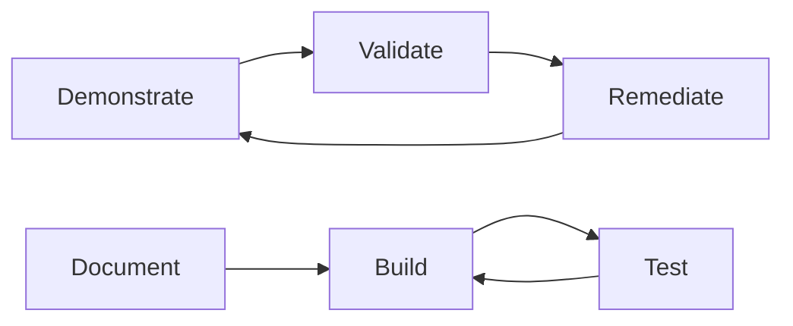
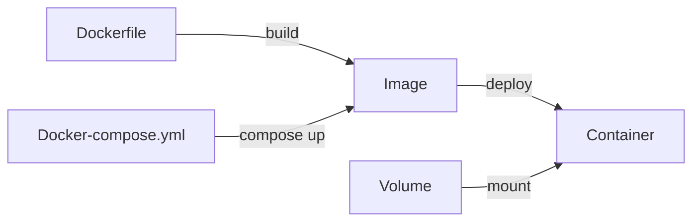
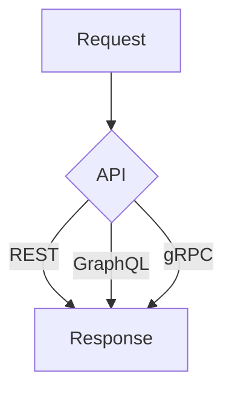
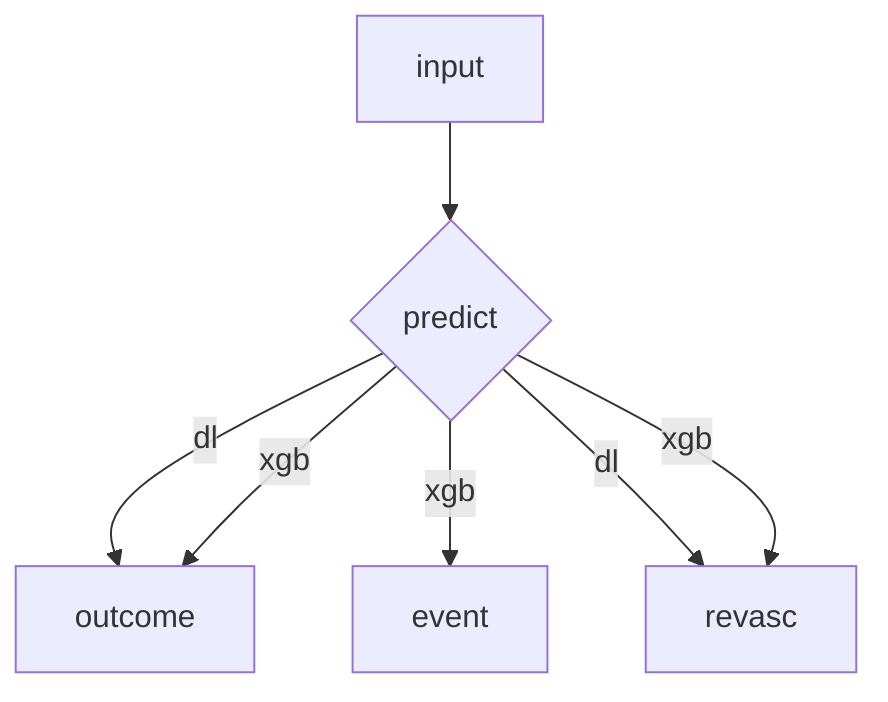
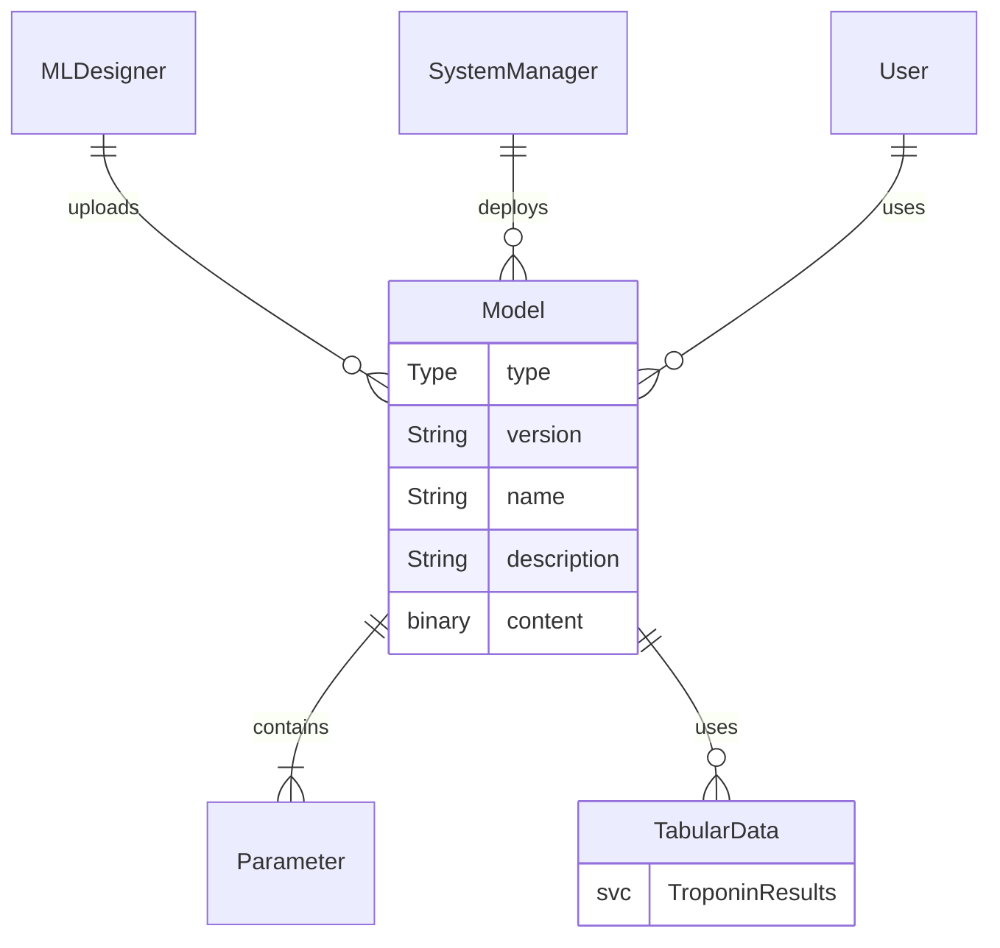
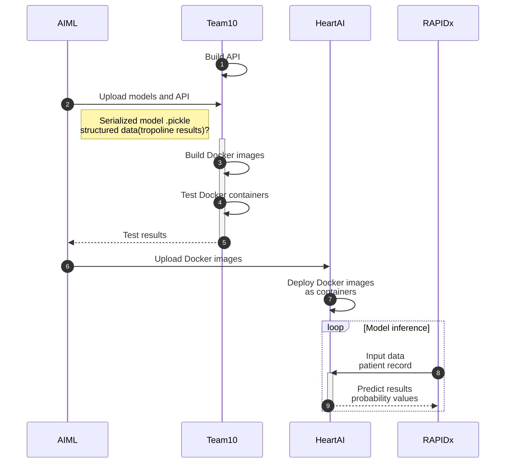
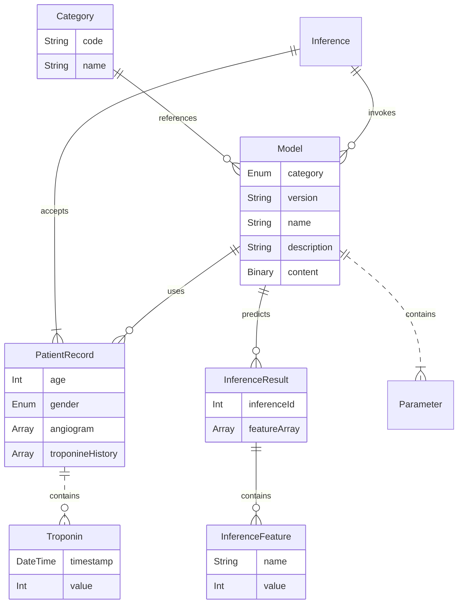
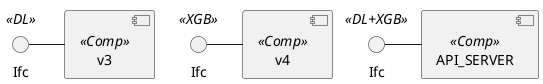

# Containerization of ML model
A bunch of myocardial infarction risk predicting ML models released by Docker container as a web service. The requirements started with a predictive model of myocardial infarction to additional requirements such as 30-day death prediction and CABG/Intervention prediction at this point. It is believed that the requirements will keep growing. This project aims to spend minimal time in adjusting or creating a new docker container every time a new ML model is built and be able to bulk process capacity if a user chooses to send package containing an arbitrary number of patient records.

## Diagrams
We actively use [Mermaid](https://mermaidjs.github.io) and [Yed](https://www.yworks.com/products/yed), [PlantUml](https://plantuml.com/) diagrams to enforce our documentation in markup format. All produced diagrams can be found in **/images/** folder. 
To read/update/render our Mermaid diagrams please use [live editor](https://mermaid.live) or VS Code Markdown extensions: [Mermaid how to](https://www.youtube.com/watch?v=JiQmpA474BY),[PlantUml how to](https://www.youtube.com/watch?v=tPh9_Cx4yZY). Also, Mermaid diagrams are automatically rendered in browser for [Microsoft DevOps](https://dev.azure.com/) wiki pages.

**Flow Diagrams**

**Docker Diagram**

**API Diagram**

**Prediction Diagram**

**Use Case Diagram**

**Sequence Diagram**

**Entity Relationship Diagram**

**Component Diagram**
